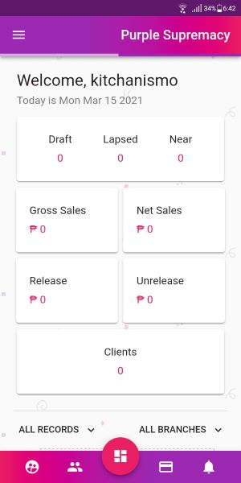
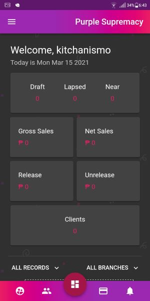
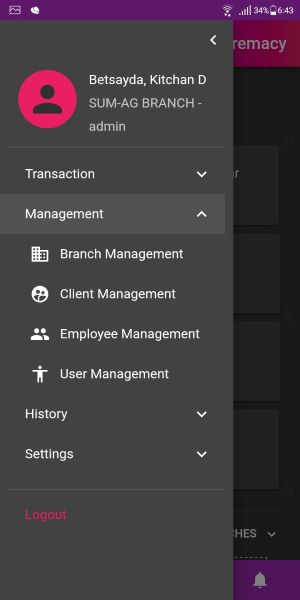
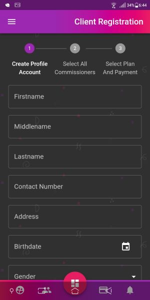

# Insurance Management System for Purple Supremacy Cascade Trading
A web application which is developed for tracking the details of the insurance policy, customer details and company details.

[https://psy-demo.herokuapp.com](https://psy-demo.herokuapp.com)

## Table of contents

- [Features](#features)
- [Technologies](#technologies)
- [Installation](#installation)
- [Deployment](#deployment)
- [Screenshots](#screenshots)

## Features

This web app consists of a features/functionalities

- Login and Authorization
- Client Management
- Employee Management
- User Management
- Encode Transaction
- Release Commission Transaction
- Payment History
- Commission History
- SMS Notifications
- SMS Task Scheduler
- Dashboard
- Image Upload
- Light and Dark Themes
- General Settings
- Account Settings

## Technologies

| Front End    | Back End     |
| ------------ | ------------ |
| React 17.0.1 | Node 14.15.3 |
| TypeScript   | Mysql        |
| Hooks        | TypeOrm      |
| JWT          | JWT/Session  |
| React Router | Express JS   |
| Material UI  | Cron Job     |
| Recharts     | Itexmo       |
| Axios        |
| Joi          |
| Cloudinary   |
| PWA          |

## Installation

To install.

```
$ yarn add
```

## Deployment

You can deploy your react app in [Vercel](http://vercel.app/) or whatever your preferred deployment platform.
And for the backend, you can deploy your server in [Heroku](https://heroku.com)

## Screenshots

<div align="center">





</div>

